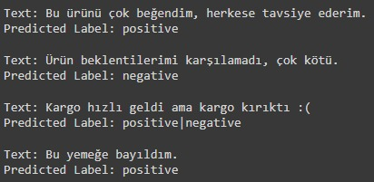
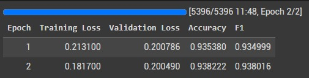
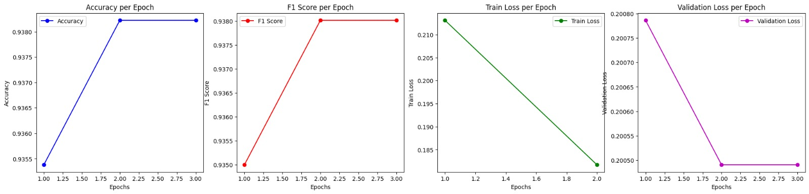
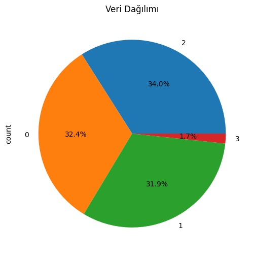
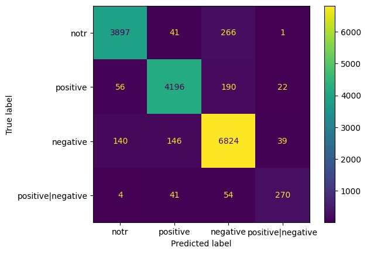
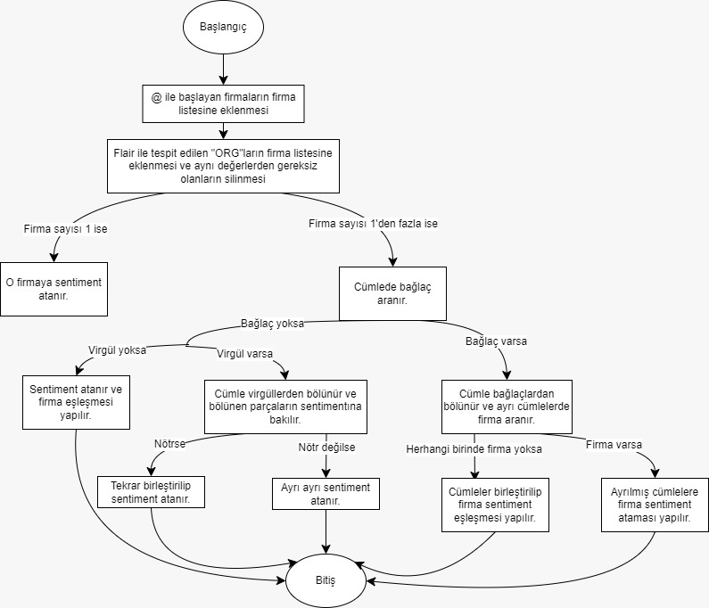
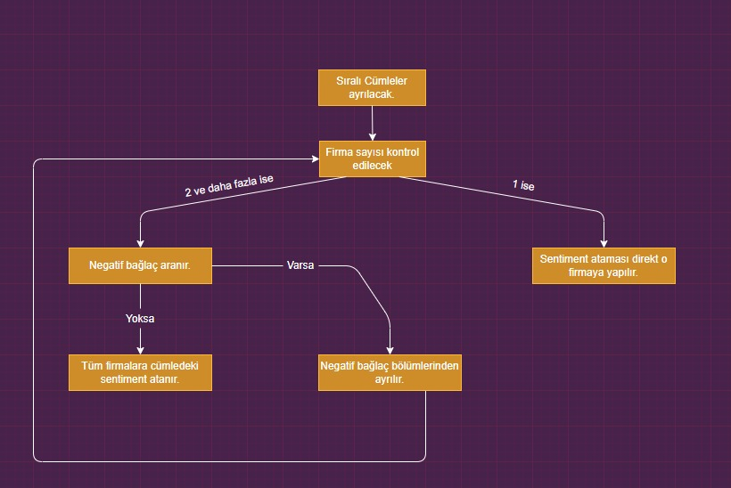

# Hezartech Test Results and Overview
---

# Test Results Overview

This document provides a detailed review of the test results from the latest model evaluation. The results are presented through tables and visualized with graphs to aid in the interpretation of the model's performance.

---

## 📊 Performance Metrics

The table below summarizes the key performance metrics across different datasets:

---

---

## 📉 Graphical Analysis

This graph shows the accuracy of the model across the different datasets.

### 1. **Data Distribution**

Data distribution of
### 2. **Confusion Matrix**

The confusion matrix for the Sentiment Analysis dataset. It illustrates the distribution of true positives, true negatives, false positives, and false negatives.

---

## Connecting firms with sentiments algorithm

## OLD algorithm

## 📝 Conclusion

The model demonstrates strong performance across all datasets, with particularly high accuracy and F1-scores in the Sentiment Analysis dataset. The visualizations indicate consistent improvement over time, suggesting effective tuning and optimization.
